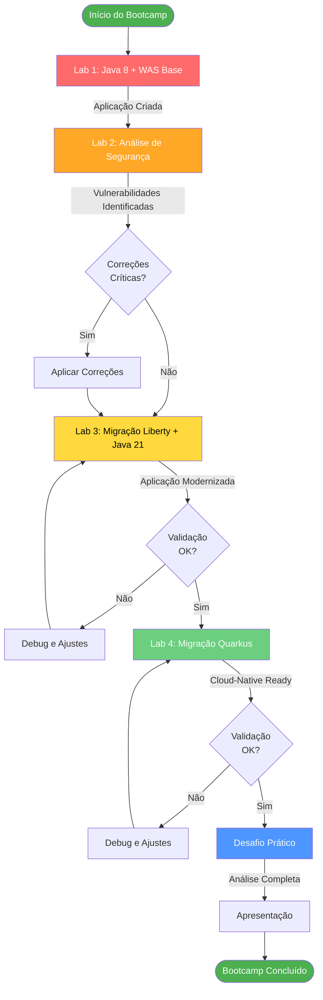
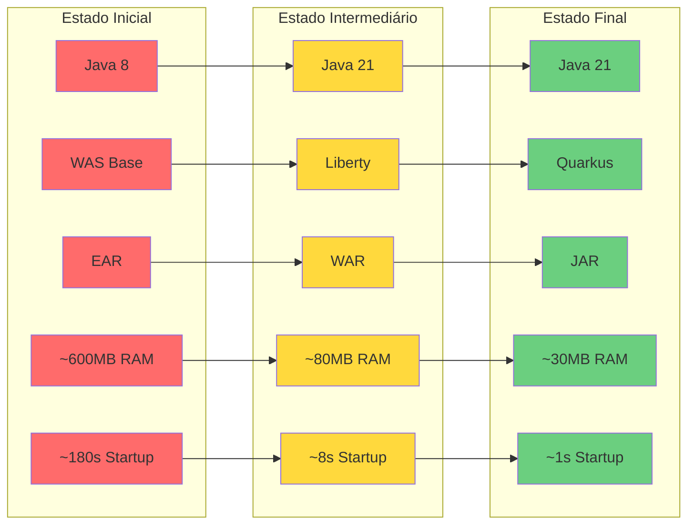
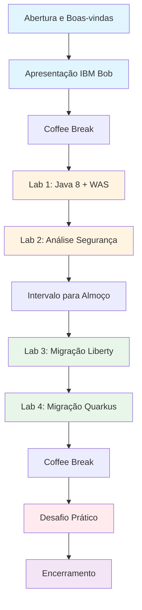
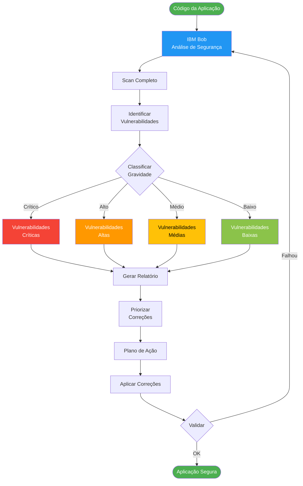
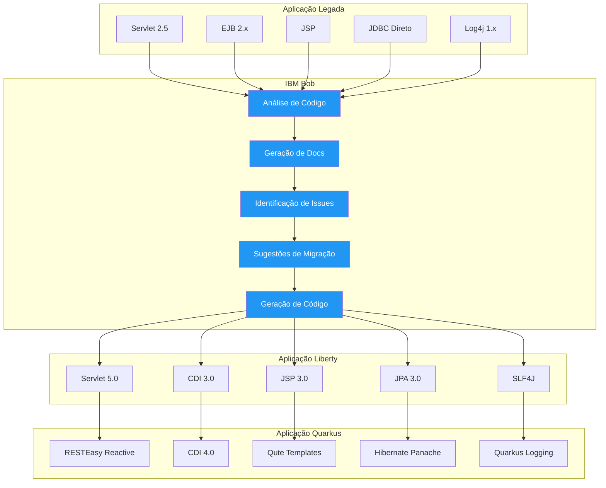
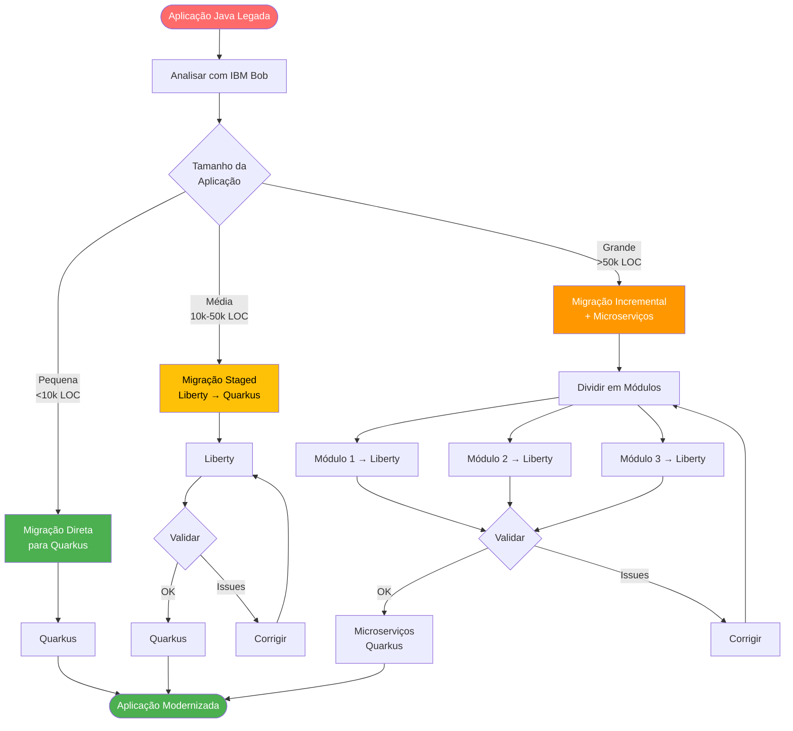
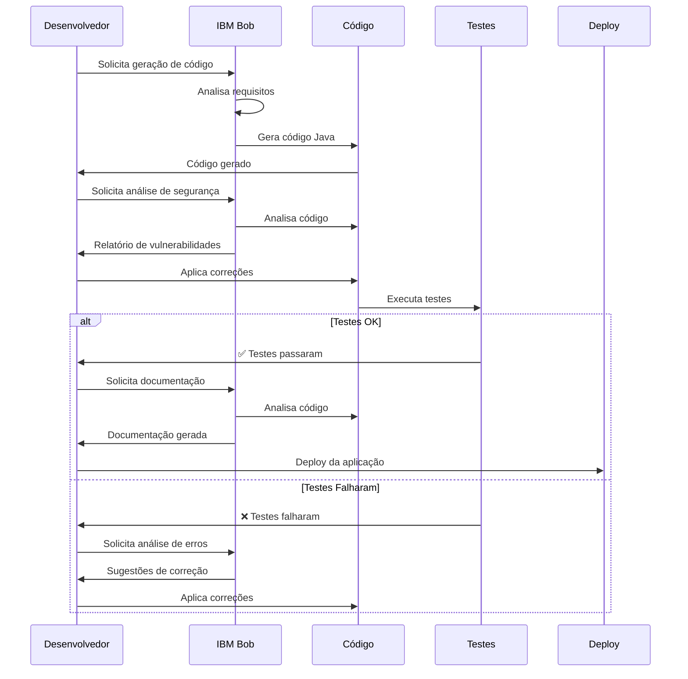
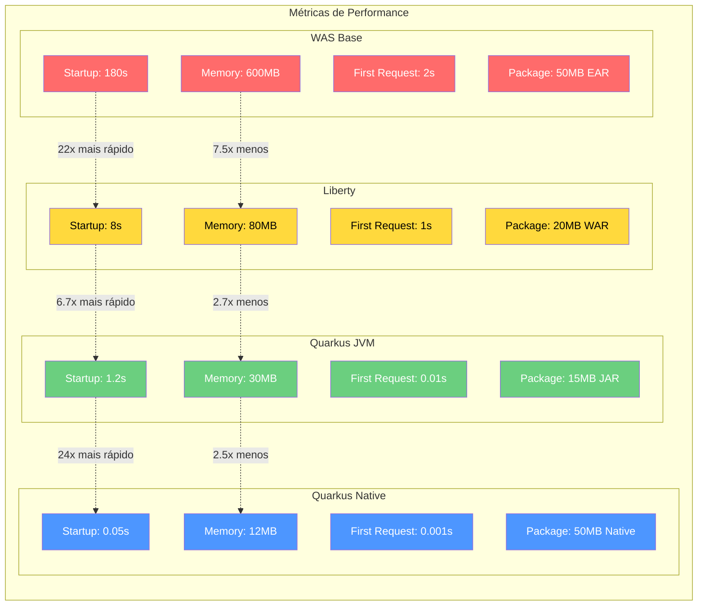
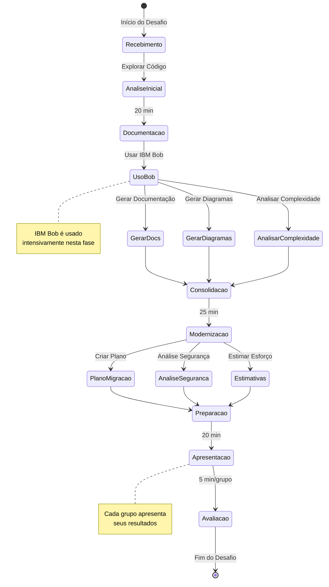
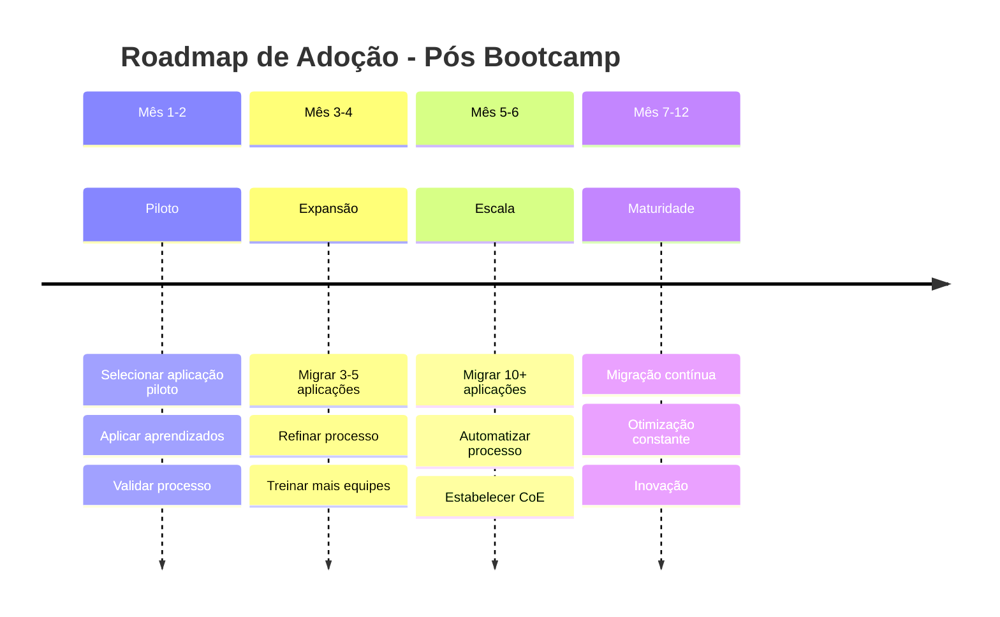

# 🔄 Fluxo de Modernização - Bootcamp

## Visão Geral da Jornada

Este documento apresenta os diagramas que ilustram a jornada completa de modernização de aplicações Java, desde aplicações legadas até arquiteturas cloud-native.

---

## 1. Fluxo Completo de Modernização

---

## 2. Evolução Tecnológica

---

## 3. Fluxo do Bootcamp

---

## 4. Processo de Análise de Segurança

---

## 5. Arquitetura de Migração - Visão Detalhada

---

## 6. Fluxo de Decisão - Estratégia de Migração

---

## 7. Ciclo de Desenvolvimento com IBM Bob

---

## 8. Comparação de Performance

---

## 9. Fluxo do Desafio Prático

---

## 10. Roadmap de Adoção Pós-Bootcamp

---

## Legenda de Cores

- 🔴 **Vermelho:** Estado inicial / Legado / Crítico
- 🟡 **Amarelo:** Estado intermediário / Atenção
- 🟢 **Verde:** Estado final / Modernizado / OK
- 🔵 **Azul:** IBM Bob / Ferramentas / Processos

---

## Como Usar Estes Diagramas

1. **Durante o Bootcamp:** Referência visual da jornada
2. **Nas Apresentações:** Ilustrar conceitos e fluxos
3. **No Desafio Prático:** Inspiração para diagramas próprios
4. **Pós-Bootcamp:** Guia para implementação real

---

**Nota:** Todos os diagramas são renderizados usando Mermaid.js e podem ser copiados e adaptados conforme necessário.

_Desenvolvido para o Bootcamp | Powered by IBM Bob_
